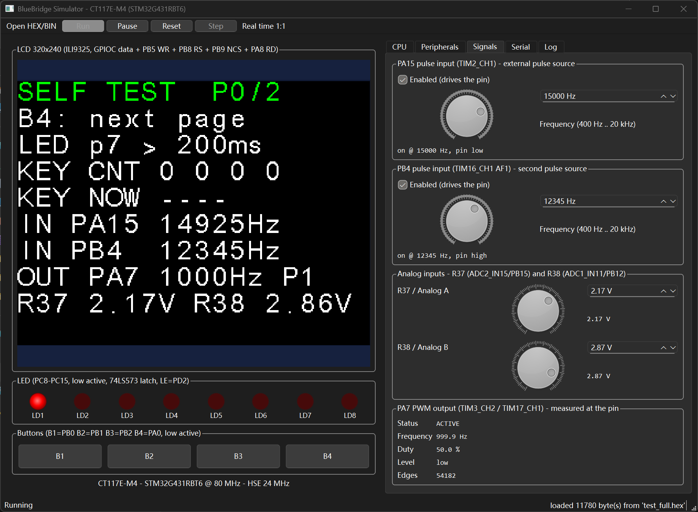
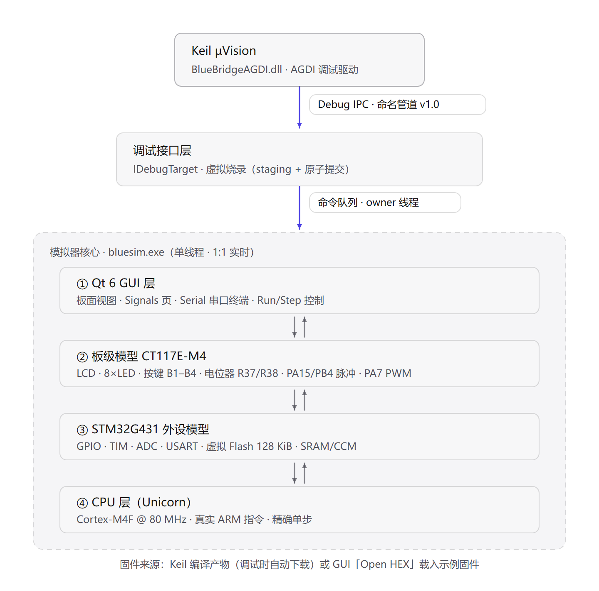
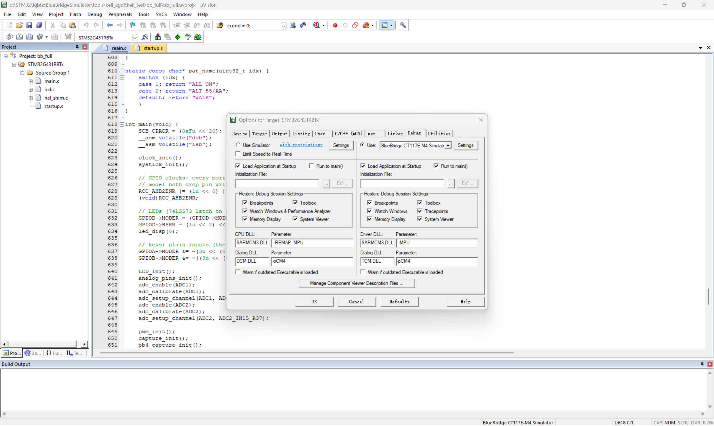
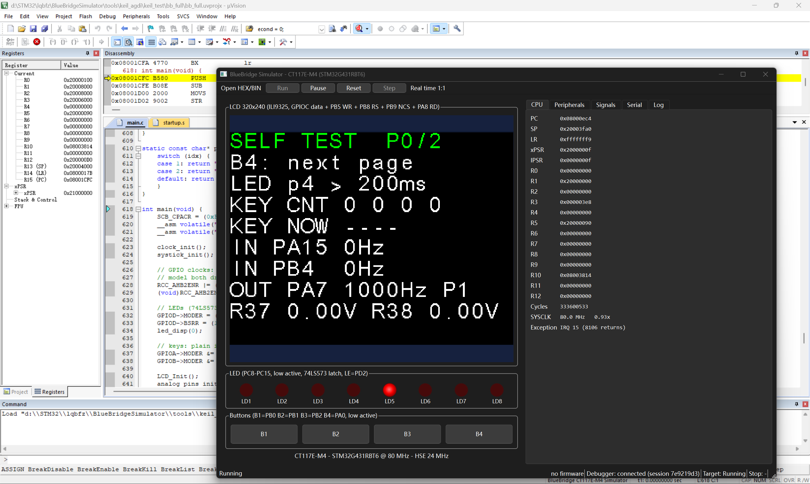

# BlueBridgeSimulator —— CT117E-M4 全软件模拟器（Keil µVision 集成）

不用真实硬件、不用 ST-Link：在 Keil µVision 里 **编译 → 启动调试 → 当前 build 自动烧进虚拟板 → 停在 `main()`**，
然后照常用断点、单步、Watch；虚拟板上的 LCD / LED / 按键 / 电位器 / 脉冲源 / PWM / 串口都在实时运行。



- 目标板：蓝桥杯 CT117E-M4（STM32G431RBT6，ARM Cortex-M4F @ 80 MHz）
- 版本：**1.0.0**（见 `VERSION.txt`）

---

## 系统架构



四层解耦：GUI → 板级模型 → STM32 外设模型 → CPU（Unicorn）；Keil 通过 AGDI 驱动与 Debug IPC 命名管道接入调试接口层。

## 功能特性

- **真实 CPU**：Unicorn 执行真实 ARM 指令（非简化模拟），1:1 实时运行
- **完整板级模型**：LCD（ILI9325）、8 路 LED、B1–B4 按键、R37/R38 电位器、
  PA15/PB4 脉冲输入、PA7 PWM 输出、USART 串口终端
- **Keil 无缝调试**：进入调试会话时自动写入当前 build（虚拟 flash 原子提交）、
  自动复位并 Run to main
- **完整调试能力**：源码断点（可多个）、Run / Stop / Reset、Continue、Run to Cursor、
  指令级单步、Step Into / Step Over / Step Out、Registers / Memory / Disassembly /
  Watch / Locals / Call Stack
- **可独立运行**：不装 Keil 也能用，直接载入 `.hex` / `.bin` 固件
- **便携**：解压即用，支持空格与中文路径；无需 VC++ 运行库、无需任何仿真器硬件

## 环境要求

- Windows 10 / 11（x64）
- Keil MDK-ARM µVision **5.43**（已实测 5.43.1.0 / MDK 5.43a；其它版本未验证）
- 不需要：ST-Link / CMSIS-DAP / OpenOCD / GDB / 任何仿真器硬件

## 安装（一次性）

1. 把整个目录解压到任意位置，**关闭 µVision**
2. 在解压目录打开 PowerShell，运行：

   ```powershell
   powershell -ExecutionPolicy Bypass -File install.ps1
   ```

3. 重新打开 µVision

安装脚本会自动定位 Keil、复制驱动、注册调试器条目并写入配置；只修改 `TOOLS.INI`
与它自己的文件（改前自动备份，可反复运行）。
**移动过产品目录**后重跑一次 `install.ps1` 即可修复路径。

## 在 Keil 里使用（推荐流程）

1. `Options for Target` → **Debug** 页：

   - `Use:` 选择 **BlueBridge CT117E-M4 Simulator**
   - 勾选 **Load Application at Startup** 与 **Run to main()**

   

2. `F7` 编译 → `Ctrl+F5` 启动调试：模拟器自动打开 → 当前 build 自动下载进虚拟 flash
   → 复位并停在 `main()`（黄色箭头）

   

3. 照常调试：断点 / Continue / 单步 / Watch / Locals / Call Stack / Registers / Memory / Disassembly
4. `Ctrl+F5` 结束会话：默认**保留**模拟器窗口（板子状态不丢，可继续在板上操作）

> **下载说明**：唯一支持的下载方式就是上面的调试会话自动下载（`Load Application at Startup`）。
> 工具栏 **Flash → Download** 在本模拟器上不会执行烧写（不支持），请使用上面的流程。

## 不用 Keil：独立模拟器

双击 `Simulator\bluesim.exe` → `Open` 载入 `Simulator\firmware\` 下的 `.hex` → `Run`。

自带示例固件：`test_full.hex`（综合自测，如上图）、`test_usart.hex`、`test_adc_pwm.hex`、
`test_lcd.hex`、`test_blink.hex`、`test_tim.hex`、`test_tim_demo.hex`。

## 板级操作

| 器件 / 功能 | 在模拟器里 |
|---|---|
| LED（PC8–PC15，PD2 锁存） | 板面 LED 排 |
| 按键 B1–B4（PB0/PB1/PB2/PA0，低有效） | 直接点击板面按键 |
| LCD | LCD 显示区（官方 BSP 位操作驱动） |
| 电位器 R37 / R38 | `Signals` 页 → R37 / R38 旋钮（0–3.3 V） |
| 脉冲输入 PA15 / PB4（TIM2_CH1 / TIM16_CH1） | `Signals` 页 → 频率设置（400 Hz–20 kHz） |
| PWM 输出 PA7（TIM3_CH2） | `Signals` 页监视频率 / 占空比 / 边沿数 |
| USART1（PA9/PA10，9600 8N1） | `Serial` 页终端（PC ⇄ MCU） |

## 卸载

```powershell
powershell -ExecutionPolicy Bypass -File uninstall.ps1
```

只移除 BlueBridge 的驱动注册与自己的文件；不影响其它驱动、Pack 和你的工程。

## 已知限制

- 数据观察点（Watchpoint）、条件断点：不支持
- SWV/ETM 指令 Trace、RTOS 感知：不支持
- `Flash → Download` 工具栏：不支持（见上文"下载说明"）
- 同一调试管道同时只允许一个客户端（第二个连接会得到 Busy）
- 二进制未做代码签名（SmartScreen 提示时选"更多信息 → 仍要运行"）

## 排错

| 现象 | 处理 |
|---|---|
| Keil 的 `Use:` 列表没有 BlueBridge 条目 | 重跑 `install.ps1`，并**完全重启 µVision** |
| 调试会话开了但模拟器没出现 | 检查 `%LOCALAPPDATA%\BlueBridgeSimulator\agdi.ini` 中的 `SimulatorPath`（移动过目录就重跑 `install.ps1`） |
| 连接失败 / Connection timeout | 看 `Simulator\bluesim.log` 与 `%LOCALAPPDATA%\BlueBridgeSimulator\logs\BlueBridgeAGDI.log` |

## 目录结构

```
BlueBridgeSimulator-v<版本>\
├─ Simulator\        bluesim.exe + Qt6 运行库 + unicorn.dll + firmware\（示例固件）
├─ Keil\             BlueBridgeAGDI.dll（驱动）+ agdi.ini（模板）
├─ install.ps1       安装（注册到 Keil）
├─ uninstall.ps1     卸载
├─ README.md         本文件
├─ VERSION.txt       版本号
├─ SHA256SUMS.txt    文件校验（可选）
└─ docs\images\      README 截图
```

## 许可协议

本项目整体以 **GPL-2.0** 开源发布（见仓库根目录 `LICENSE`）：模拟器链接了 GPLv2 的
Unicorn 引擎，因此整体采用兼容的 copyleft 许可。你可以自由使用、修改、再分发；
再分发修改版时需以同一许可开源。

## 第三方组件

- Qt 6.8.3 运行库（LGPL，动态链接方式使用）
- Unicorn 2.1.4（GPLv2，本仓库打了补丁后自行构建）
- 不包含 Keil 官方 AGDI SDK 源码